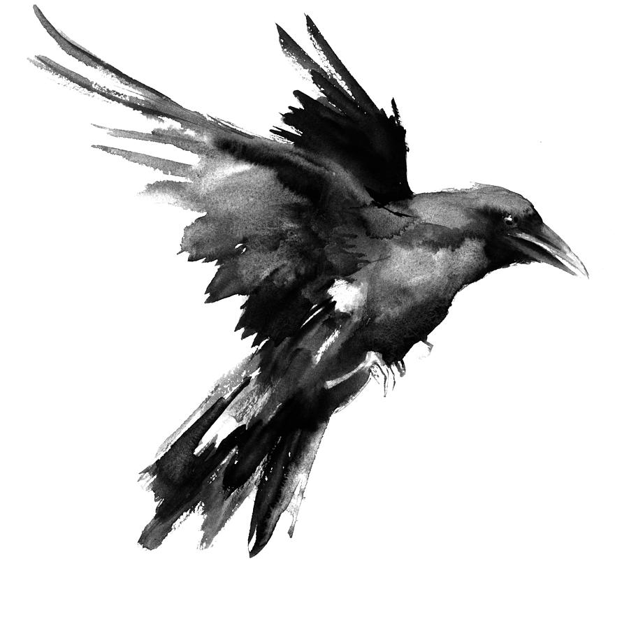

***[Web Site](http://ravensc.com)***

***[Manual](https://guenchi.gitbooks.io/raven/content/)***

***[Packages List](http://ravensc.com/list)***


*** the Raven libraries generally work fine on the R6RS implatetion, except for some built on the c library which dependent on Chez Scheme's FFI.***


Running project: 

```
$ raven run exemple.sc
```


The project Raven is supported by [theschemer.org](http://theschemer.org)

The principal developers are: [guenchi](https://github.com/guenchi), [chclock](https://github.com/chclock)

Nota Bene: We recommend that the libraries for Raven files use .sc for distinguishing the libraries of r5rs / r7rs small.
